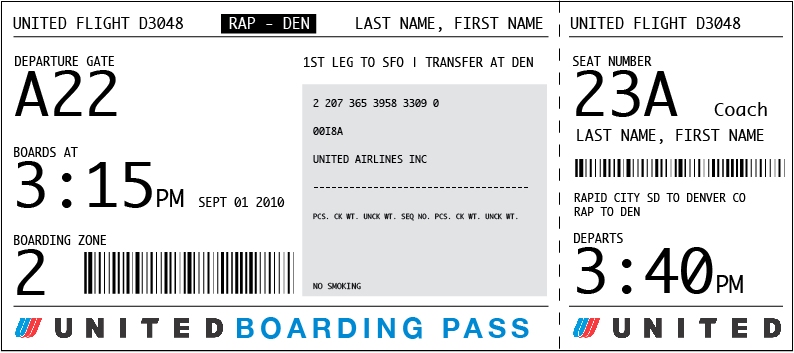

# Generating Fixtures

-----

# ./manage.py dumpdata some_app > some_app/fixtures/test_data.json

-----

# Do you already have data?

[Image source](http://en.memory-alpha.org/wiki/Data)

-----

# What about time sensitive data?

[Image souce](http://passfail.squarespace.com/)

-----

# Going back to the admin to update and re-dump after schema changes?

  

[Image source](http://www.davidtan.org/drupal-cheat-sheet-and-database-schema/)

-----

# Time sensitive tests

## Model and Manager

    !python

    class SomeManager(models.Manager):
        def future(self):
            return self.get_query_set().filter(pub_date__gte=datetime.today())

    class SomeClass(models.Model):
        pub_date = models.DateField()
        objects = SomeManager()

## Test

    !python

    class SomeManagerTest(TestCase):
        fixtures = "some_fixtures.json"

        def test_future_method(self):
            self.assertEqual(4, SomeClass.objects.future().count())

------

# Tests that pass today may not pass tomorrow

  

[Image source](http://www.uglypersonsface.com/fridge2/)

-----

# Alternative strategies

## Generating fixture files

## Automatic model factories

## Custom fixture factories

-----

# Generating fixture files   (django-fixture-generator)

-----

# Automatic model factories   (django-any)

-----

    !python
    class Event(models.Model):
        title = models.CharField(max_length=100)
        start_date = models.DateField(default=datetime.today())
        description = models.TextField()

    class EventTestCase(TestCase):
        def setUp(self):
            yesterday = datetime.today() - datetime.timedelta(days=1)
            tomorrow = datetime.today() + datetime.timedelta(days=1)
            old_event = any_model(Event, start_date=yesterday)
            current_event = any_model(Event)
            future_event = any_model(Event, start_date=tomorrow)

-----

# Custom factories/mixins

------

    !python
    class MyFactoryMixin(object):
        def get_category(self, name=""):
            return CategoryModel.objects.create(name=name)

        def get_event(self, title, start_date):
            return EventModel.objects.create(start_date=start_date,
                    title=title, category=self.get_category())

        def setUp(self):
            yesterday = datetime.today() - datetime.timedelta(days=1)
            tomorrow = datetime.today() + datetime.timedelta(days=1)
            old_event = self.get_event("Old event", start_date=yesterday)
            future_event = self.get_event("Old event", start_date=tomorrow)

    class ModelTestCase(MyFactoryMixin, TestCase):
        ...

    class ViewModelTestCase(MyFactoryMixin, TestCase):
        ...

    class FormsTestCase(MyFactoryMixin, TestCase):
        ...

------

# Try them all

* [https://github.com/alex/django-fixture-generator](https://github.com/alex/django-fixture-generator)
* [https://github.com/kmmbvnr/django-any](https://github.com/kmmbvnr/django-any)

# Lots more packages

[http://djangopackages.com/grids/g/fixtures/](http://djangopackages.com/grids/g/fixtures/)

-----

# Reduce coupling!

* Break up validation from model to forms

-----

# Question, comments, concerns, queries?

  

* Ben Lopatin, February 2012
* Twitter [@bennylope](http://twitter.com/bennylope)
* GitHub [bennylope](http://github.com/bennylope)
* Principal/Developer @ [Wellfire Interactive](http://www.wellfireinteractive.com)
