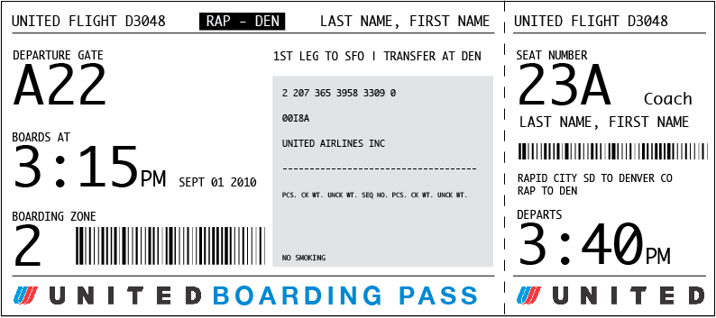
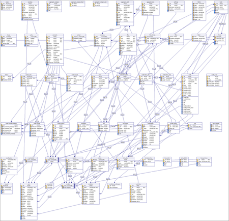
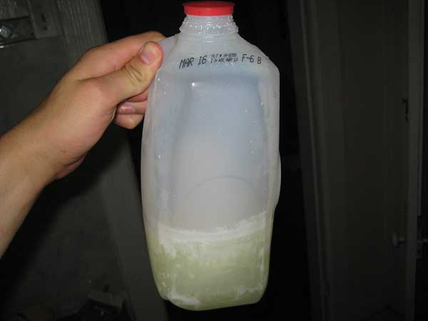

# Generating Fixtures

-----

# ./manage.py dumpdata some_app > some_app/fixtures/test_data.json

-----

# Presumption that you have data

[Image source](http://en.memory-alpha.org/wiki/Data)

-----

# What about time sensitive data?

[Image souce](http://passfail.squarespace.com/)

-----

# Edit data through admin to re-dump after schema changes?

  

[Image source](http://www.davidtan.org/drupal-cheat-sheet-and-database-schema/)

-----

# Time sensitive tests

## Model and Manager

    !python
    class SomeManager(models.Manager):
        def future(self):
            return self.get_query_set().filter(pub_date__gte=datetime.today())

    class SomeClass(models.Model):
        pub_date = models.DateField()
        objects = SomeManager()

## Test

    !python
    class SomeManagerTest(TestCase):
        fixtures = "some_fixtures.json"

        def test_future_method(self):
            self.assertEqual(4, SomeClass.objects.future().count())

------

# Tests that pass today may not pass tomorrow

  

[Image source](http://www.uglypersonsface.com/fridge2/)

-----

# Alternative strategies

## Generating fixture files

## Dynamic object generators

## Application based object generators

-----

# Generating fixture files   ([django-fixture-generator](https://github.com/alex/django-fixture-generator))

-----

    !python
    from fixture_generator import fixture_generator

    from events.models import EventCategory, Event
    from django.contrib.auth.models import User, Group

    @fixture_generator(User, requires=["events.test_categories"])
    def test_users():
        festival, tasting = EventCategory.objects.order_by("name")
        fortnights_festival = Event.objects.create(
                title="Beer Fest",
                start_date=datetime.today() - timedelta(days=14),
                category=festival)
        tomorrows_tasting = Event.objects.create(
                title="Tripel Tasting",
                start_date=datetime.today() + timedelta(days=1),
                category=tasting)

    @fixture_generator(Category)
    def test_categories():
        EventCategory.objects.create(name="Tasting")
        EventCategory.objects.create(name="Festival")

-----

# Re-generate fixtures as needed

    ./manage.py generate_fixture my_app.test_users

# Update fixtures for date sensitivity

# Modify fixture definitions for schema changes

-----

# Dynamic object generators   ([django-any](https://github.com/kmmbvnr/django-any))

-----

    !python
    class Event(models.Model):
        title = models.CharField(max_length=100)
        start_date = models.DateField(default=datetime.today())
        description = models.TextField()

    class EventTestCase(TestCase):
        def setUp(self):
            yesterday = datetime.today() - timedelta(days=1)
            tomorrow = datetime.today() + timedelta(days=1)
            old_event = any_model(Event, start_date=yesterday)
            current_event = any_model(Event)
            future_event = any_model(Event, start_date=tomorrow)

-----

# Application based object generators

------

    !python
    class MyGeneratorMixin(object):
        def get_category(self, name=""):
            return CategoryModel.objects.create(name=name)

        def get_event(self, title, start_date):
            return EventModel.objects.create(start_date=start_date,
                    title=title, category=self.get_category())

        def setUp(self):
            yesterday = datetime.today() - timedelta(days=1)
            tomorrow = datetime.today() + timedelta(days=1)
            old_event = self.get_event("Old event", start_date=yesterday)
            future_event = self.get_event("Old event", start_date=tomorrow)

    class ModelTestCase(MyGeneratorMixin, TestCase):
        ...

    class ViewModelTestCase(MyGeneratorMixin, TestCase):
        ...

    class FormsTestCase(MyGeneratorMixin, TestCase):
        ...

------

# Lots of options

* [Fixture related packages on Django Packages](http://djangopackages.com/grids/g/fixtures/)

* [django-fixture-generator](https://github.com/alex/django-fixture-generator)

* [django-any](https://github.com/kmmbvnr/django-any)

-----

# Final notes

# Reduce coupling!
# Performance differences -> unknown

-----

# Question, comments, concerns, queries?

  

* Ben Lopatin, February 2012
* Twitter [@bennylope](http://twitter.com/bennylope)
* GitHub [bennylope](http://github.com/bennylope)
* Principal/Developer @ [Wellfire Interactive](https://wellfire.co)

None of the code in this presentation has been tested. Many module
imports are implied.

